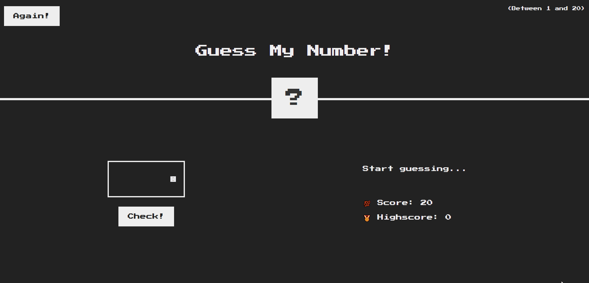

# Guess My Number

Hello there,

Here is the game **Guess My Number**. :question:

The goal is to find the winning number between **1 and 20** by trying to make as few attempts as possible.

You have up to **20 tries** to find this famous number. :smiling_imp:

The **winning number** is *randomly generated* at the beginning of each game with the **Math.random() function**. :fire:

:trophy: Once the right number is found you can start a new game trying to improve your score.

**Challenge** your friends or co-workers during lunch break :sushi: and see who will be the **smartest**.

The design of this page is realized with :

* HTML
* CSS
* JavaScript

This project highlights **dom manipulation** in JavaScript.

A design a little **retro game** made in CSS.

## Requirements

1. Nothing, just pull the project and have fun

## Below a gif allowing to realize the design and how the game works

